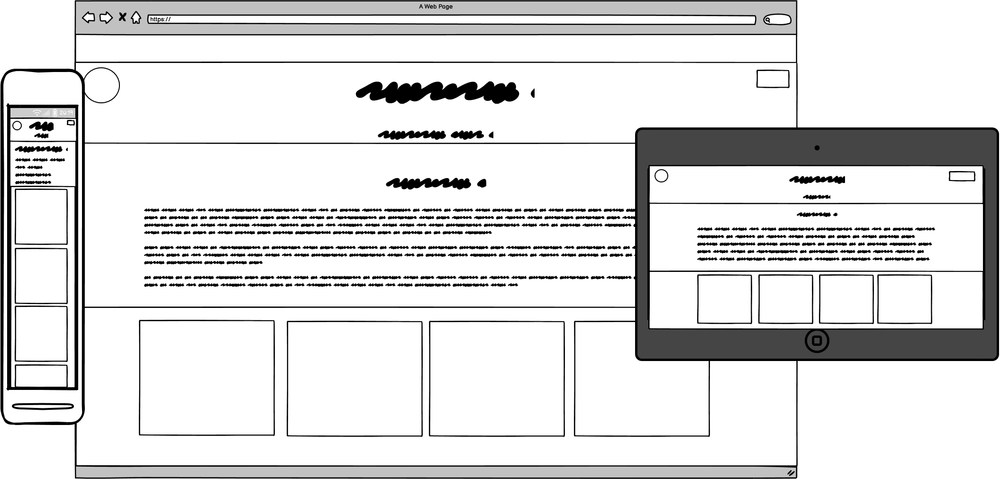
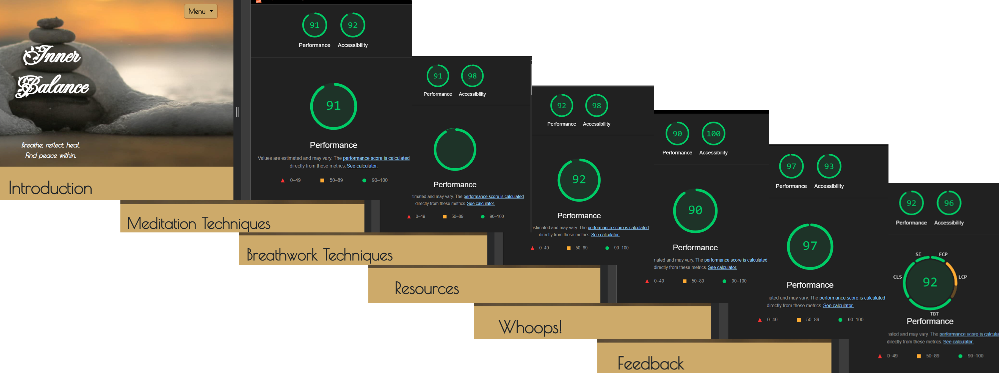

<h1 align="center">Inner Balance</h1>

Welcome to the readme to ‘Inner Balance’, my first milestone project for the Code Institutes Full Stack Software Developer Bootcamp. 

 

 
The live project can be found here: <a target="_blank" href="https://ekennard.github.io/Inner-Balance/"><em>Inner Balance<em></a>

 
 

## Contents

- [Introduction](#introduction)
  - [Brief](#brief)
  -	[Key objectives](#key-objectives)
- [UX/UI Design](#ux/ui_design)
  -	[User Stories](#user-stories)
  -	[Wireframes](#wireframes)
  -	[Colour Design](#colour-design)
  -	[Imagery](#imagery)
  -	[Fonts](#fonts)
- [Features](#features)
  -	[Navigation](#navigation)
  -	[Main content](#main-content)
- [AI Utilisation](#ai-utilisation)
- [Deployment](#deployment)
- [Testing and Debugging](#testing-and-debugging)
- [Validation](#validation)
- [Resources and Credits](#resources-and-credits)
- [Project Reflections](#project_reflections)

# Introduction

### Brief
Inner Balance is a wellness-focused website built using HTML, CSS, and Bootstrap to promote mindfulness and mental well-being. It is designed to introduce users to meditation and breathwork techniques, giving them the tools they need to combat stress and anxiety. 
 
### Key Objectives
-	Provide meditation guides for beginners and experienced practitioners alike.
-	Create a soothing visual atmosphere to encourage relaxation.
-	Ensure mobile responsiveness for seamless user experience across devices.
-	Utilize Bootstrap components for structured and engaging design.

## UX/UI Design

The website is designed for:
- Users seeking beginner-friendly guidance on meditation and breathwork techniques .
- Those looking for accessible, and easy-to-navigate wellness resources.

### User Stories
#### Must Haves:
<li>As a user, I want a calming and visually appealing homepage with clear navigation links to the different sections within the page so that I feel immediately relaxed when I visit the site and can easily access relevant content.
<li>As a user, I want a responsive layout so that I can use the site across different devices.
<li>As a user, I want a structured footer with a section for mental health support with links so that I can find external resources for further help.
<li>As a user, I want accessible content with clear content and contrast so that I can read comfortably without strain.
<li>As a user, I want a meditation technique section with simple explanations so that I can easily understand and practice new methods.
<li>As a user, I want a breathwork technique section with simple explanations so that I can easily understand and practice new methods.

 #### Should Haves:

<li>As a user, I want soft hover effects on interactive elements so that the experience feels more intuitive and polished.
<li>As a user, I want a colour-customizable UI so that I can choose between a warm and cool colour scheme.

#### Could Haves:

<li>As a user, I want an interactive breathing graphic so that I can do a breathing exercise whilst following alongside the animation.
<li>As a user, I want a meditation playlist suggestion section so that I can listen to calming music while meditating.

### Wireframes

Balsamiq was used to design the wireframes and to outline the key outline of the features across 3 device sizes; small screen, medium screens and large screens. 

A basic design was chosen to complement the content of the site, and consisted of a hero section with an image, a logo and a menu button, followed by a main section with text and information and/or link cards, and a footer with links to proffesional mental health bodies.

### Colour Design 
The colour pallette for this was purposefully very limited in order to be calming, and to not distract from the content. It consisted of black and white for the font (depending on background contrast needs) alongside a pale yellow/sand for the main backgrouns and highlight colour (though this had some opacity adjustments) and a rusty-orange colour for hover actions and acents. These colours had several iterations throughout the deveolpment stage due to user testing (see below).

There was also a secondary colour shceme planned which followed the brand imagery colours, though this was not implemented for this project.

### Imagery
The majority of the imagery used for the site was AI generated. The exceptions being the Hero image which was a promintent feature on all pages and was aquired from Unsplash.com, and the Octopus gif features on the Exercices page which came from Giphly.com. All the static images were compressed using Squoosh before being used.Several Hero images were initially tested before settling on the final due to its symetry, general colouring and soothing nature. 

The 'brand' imagery, was produced from a single AI generated image which was copied and have the colour properties altered in Microsoft photo editer. These were then used to create the page links at the bottom of each page, the logo, and the favicon.

### Fonts
Two fonts were chosen for the site. The primary font being a more decorative one used solely on the site hero section for the site name, and the second a more practical and (hopefully) still quite decorative one for all the content. 

## Features
### Navigation
The main navigation feature of the site cased quite a few problems initially. Initialy I used a Bootstrap Navbar, however a ridiculous amount of time, compared the the total alotted project time, was spent trying to get it to work properly with the site, and in the end it was scrapped for a homemade button and list using bootstrap classes.
The end result was more compact and fully responsive, and overall more visually appealing.

### Main Content
The main content started off on one page, but as I got more into the project I felt the need to expand the site across several pages.
All pages have the same colour scheme and basic structure with hero section, main body, and footer.  The Meditation, Breathwork and Resource pages all feature cards in the main body section, with images, descriptions, and links for the resources. With the exception of the Introduction page, which has links for proffessional mental health bodies, all the footers contain the branded navigation cards for the other 4 main pages.  The Excercises page features a gif and a message saying "Whoops" as the page is still under construction (purposfully so) and a button to return the use to the into page.   The final page contains a feedback form with three text input feilds for name and elaim, and 2 bootstrap ranges for the user do indicate their happines with the layour and accessibility. The submit buttom returns the Code Institutes code dump window with the form imputs.

## AI Utilisation
As AI was required for this project, but I also wanted to do as much codeing of the site myself, I decided to use AI only for the creation of images, written content, and for the coding of the footer section on the intro page. This was partly to illistrate the differences between the capabilities between a human coding and Ai, but mainly as I wanted to gain as much experience as test how ,much I had taken on board.  As a result the introduction footer does deviate somewhat from the page colour scheme a little bit, but over I feel it works well.

## Deployment
The site was deployed early on Github Pages which allowed me to debug and test as I was developing the site.
## Testing and Debugging
When most of the main content was on the Introduction, Meditation and Breahwork pages I sent the live link to a few family and friends to help look for major styling and accesibility issues. The unanimous feedback from which was: 
A - The font was too small, and to faint. 
B - The contrast between the written content and the coloor of the page background was not good enough.

This allowed me to change the colour scheme to what is now the final version before final deployment as well as adressing the issues with the font early on.

Much debugging was done throughout the project due to early deployment, and without the use of AI to help I was forced to rely on my practice skills such as using the documentation, internet research and using Chrome Development tools. Overall I feel this was a good decision as it has helped both my understanding, and confidence in using these resources, and in my ability to find solutions for myself.

A final round of user testing once the project was in a complete state ensured all features were working and still responsive, along with some typos, which were then corrected.
## Validation
The html validation checks took a lot longer than I expected, and infinatly longer than I had hoped. Numerous errors were thrown up, from unclosed tags, end tags without opening tags, buttons within a tags...just to name a few. As a consequence I ended up returning to my good friend 'Documentation' to try and fix the issues, and learning a few more things. After several hours however all pages passed with no errors, and only the occasional trailing closing tag. 
The CSS howver passed without issue on the first try :)
 

## Resources and Credits

 - Bootstrap 
   - for the main page structural elements and styling:
   - https://getbootstrap.com/ 
 - Adobe Express 
   - for image editing:
   - https://new.express.adobe.com/
- Coolors 
  - for the selection of colour pallets:
  - https://coolors.co/
- Font Awesome 
  - for icons:
  - https://fontawesome.com/
- Markdown Guide 
  - documentation guide for the creation of this readme document:
  - https://www.markdownguide.org/
- Favicon.io
  - for the creation of favicons
  - https://favicon.io/
- Unsplash
  - for free stock photos
  - https://unsplash.com/
- Google Fonts
  - for font styles
  - https://fonts.google.com/
- Giphy
  - for the 'under construction' octopus gif
  - https://giphy.com/
- Healthline.com
  - for the modal image of the 7 chakras
  - https://www.healthline.com/health/fitness-exercise/7-chakras

## Project Reflections
Overall I am pleased with how this project went, and I had a lot of fun creating it. The hardest aspect of the project was encountered in the first day, when I was trying to implement the bootstrap navbar. I couldn't get it styles correcty anf ended up going another route and using a drop down button.   The project as a whole has been an invaluable experiecne and has taught me a lot about researching and finding answers to coding issues, and generally cementing all that I had been taught in the course module.  We were budgeted 1 day for planning, and three days of building (plus and additional 2 over the weekend if we desired). Of this I used the full planning day, plus the full 3 days building.  I had initially wanted to implement a toggle for different colour schemes, and a page with a visual feature that the the user could interact with and would help guide the user in a breathing ecersize and/or meditation. Both of these features would require the use of Javascript, so I have left the page available for these to be added in the future.